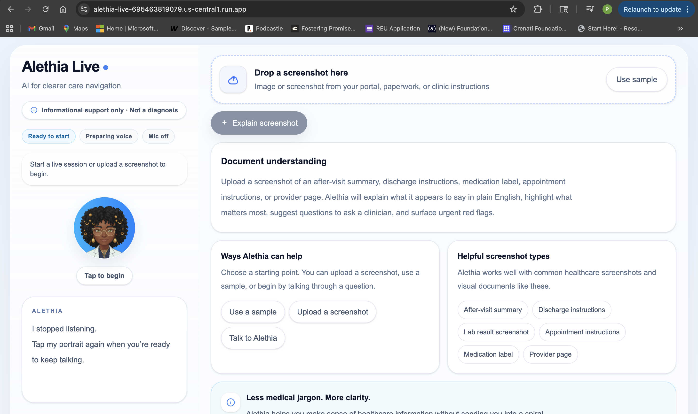
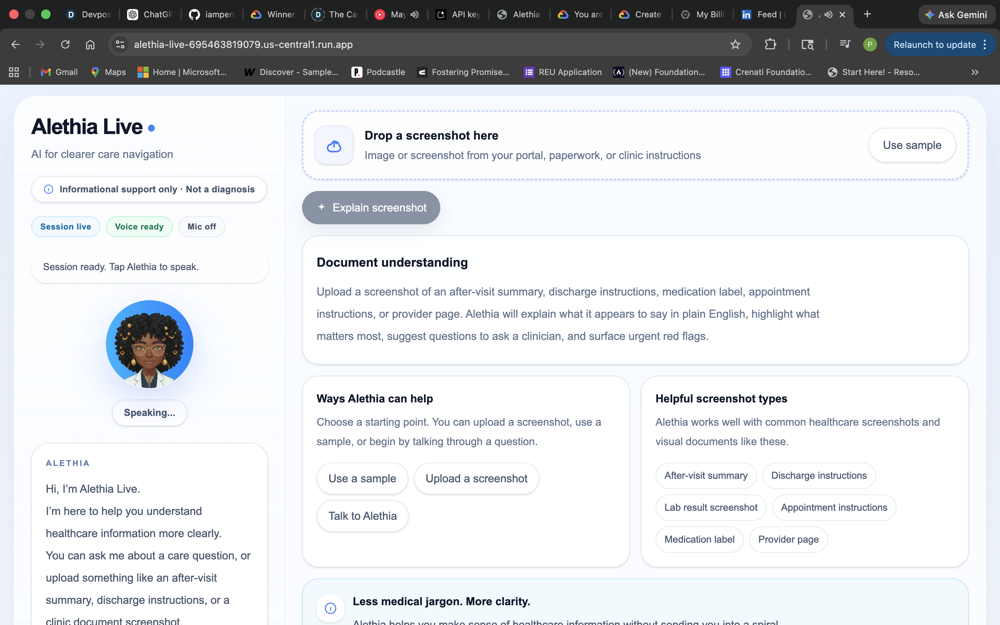
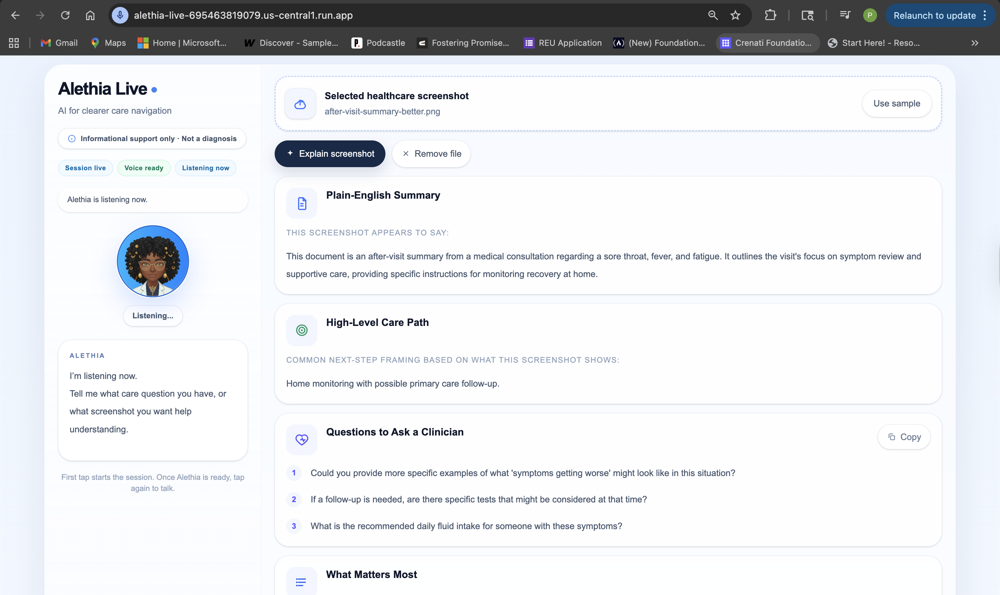
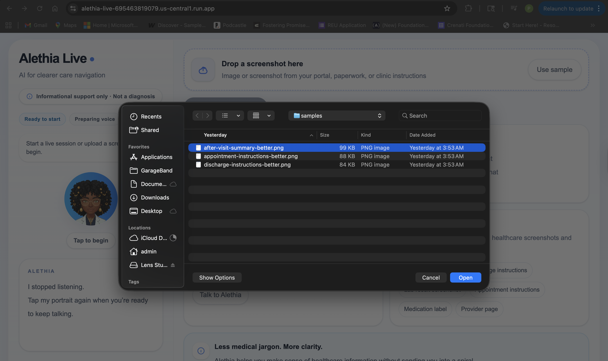
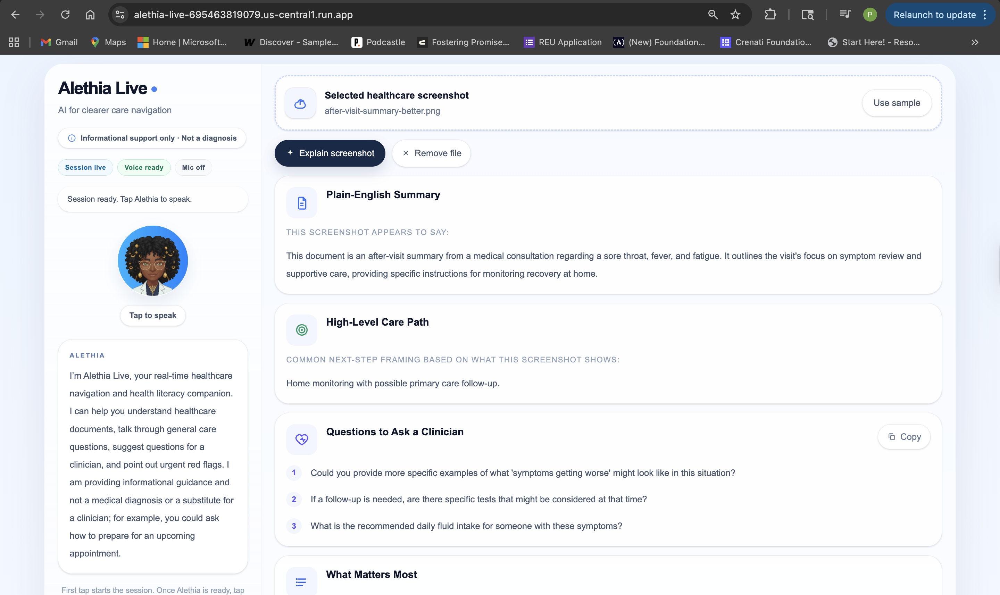
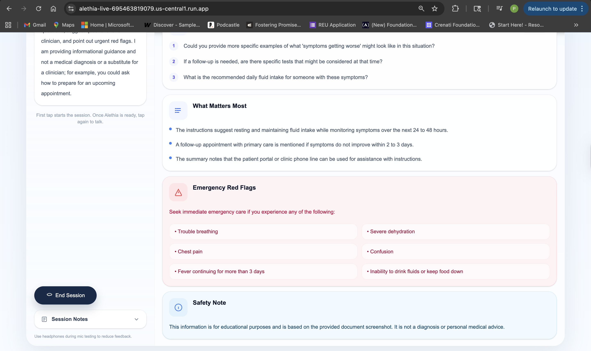

# Alethia Live

**A real-time healthcare navigation and health literacy companion built for the Gemini Live Agent Challenge 2026.**

Alethia Live helps people better understand healthcare information without pretending to diagnose them. It combines **live voice interaction** with **screenshot-based document understanding** to help users talk through care questions, make sense of healthcare paperwork in plain English, prepare better questions for a clinician, and notice urgent red flags.

## Why this project exists

Healthcare information is often confusing at exactly the moment people need clarity most.

People leave visits with after-visit summaries, discharge instructions, portal messages, medication labels, and appointment instructions that are packed with unfamiliar language. They also have everyday care-navigation questions like:

- “Should I wait and monitor this?”
- “Should I book an appointment?”
- “What should I ask the clinic?”
- “What in this document actually matters?”

Alethia Live is designed to help with that gap.

It is **not** a diagnostic system, treatment recommender, or medication advisor.  
It is an **informational companion** focused on safer, clearer healthcare navigation and health literacy support.

---

## Built for the Gemini Live Agent Challenge

Alethia Live is intentionally designed to match the challenge requirements:

- **New next-generation AI agent**
- **Uses a Gemini model**
- **Uses the Google GenAI SDK**
- **Uses Google Cloud**
- **Hosted on Google Cloud Run**
- **Multimodal**
- **Goes beyond simple text-in / text-out**

### Challenge fit at a glance

| Requirement | Alethia Live implementation |
|---|---|
| Gemini model | Gemini via `@google/genai` |
| Live agent behavior | Real-time voice session using Gemini Live |
| Multimodal | Voice + image/screenshot understanding |
| Google Cloud service | Cloud Run |
| Hosted on Google Cloud | Deployed on Cloud Run |
| Public code repo | This repository |
| Demo-ready architecture | Single Next.js app with browser + API routes |

---

## What Alethia Live does

Alethia Live focuses on two main experiences:

### 1) Live voice support
A user can speak naturally about a care question or healthcare confusion.

Alethia Live:
- listens in real time
- asks clarifying questions
- summarizes the concern in plain English
- suggests a **high-level care-path category**
- suggests questions to ask a clinician
- points out emergency red flags
- repeatedly frames itself as informational, not diagnostic

### 2) Screenshot and document understanding
A user can upload a screenshot such as:
- after-visit summary
- discharge instructions
- appointment instructions
- medication label
- provider page
- lab result screenshot

Alethia Live:
- explains what the screenshot appears to say
- highlights what matters most
- gives high-level care-path framing
- suggests questions to ask a clinician
- surfaces emergency red flags
- keeps the output document-anchored and safety-bounded

---

## Core product principles

Alethia Live is built around a narrow, practical product scope.

### It is
- a real-time healthcare navigation companion
- a health literacy support tool
- a document explanation assistant
- a question-prep tool for clinical conversations
- a red-flag escalation aid

### It is not
- a diagnosis engine
- a symptom checker that concludes likely diseases
- a treatment recommender
- a medication advisor
- a substitute for a licensed clinician

---

## Safety boundaries

Alethia Live was intentionally constrained to avoid unsafe healthcare overreach.

### Allowed behaviors
- plain-English explanation
- health literacy support
- high-level care-path framing
- questions to ask a clinician
- urgent/emergency red-flag surfacing

### Not allowed
- “You probably have X”
- “This is likely Y”
- “Take Z medication”
- definitive clinical conclusions
- overconfident treatment guidance
- telling users they do not need care

### Safety stance
Alethia Live is informational only and repeatedly says so in both interface copy and output behavior.

For uploaded screenshots, the wording is intentionally document-anchored:

- “This screenshot appears to say...”
- “The instructions shown here recommend...”
- “This document mentions...”
- “You could ask the clinic...”

instead of direct prescriptive phrasing.

---

## Why this is a live agent instead of a basic chatbot

Alethia Live is not just a static prompt box.

It combines:

- **real-time live voice session behavior**
- **turn-based audio interaction**
- **browser microphone streaming**
- **Gemini Live setup + session lifecycle**
- **screenshot understanding**
- **structured UI output for decision support**

That makes it a stronger fit for the **Live Agents** category than a standard text chatbot.

---

## Demo scenarios

### Scenario 1 — care navigation question
User says:

> “I’ve had a fever and sore throat for two days. I’m not sure if I should wait, book an appointment, or go somewhere urgent.”

Alethia Live should:
- ask a few clarifying questions
- summarize the concern
- suggest a high-level care path
- provide questions to ask a clinician
- mention emergency red flags
- stay informational and non-diagnostic

### Scenario 2 — healthcare screenshot understanding
User uploads a screenshot such as an after-visit summary or discharge instructions.

Alethia Live should:
- explain it in plain English
- highlight what matters most
- give high-level next-step framing
- suggest questions to ask the clinic or doctor
- surface urgent red flags if relevant

---

## Product screenshots

### Home screen

### Live session speaking state

### Live session listening state

### Screenshot upload flow

### Structured screenshot understanding output

### Red flags and safety note output

---

## Architecture

Alethia Live uses a **single Next.js web app** for the fastest realistic hackathon path.

### High-level system design

- **Browser frontend**
  - portrait-centered voice interaction
  - screenshot upload flow
  - structured output cards
- **Next.js API routes**
  - ephemeral live token route
  - structured screenshot summary route
- **Gemini Live**
  - real-time voice session
  - turn lifecycle
  - audio output
- **Gemini structured generation**
  - screenshot/document explanation
  - structured result cards
- **Google Cloud Run**
  - hosted deployment

### Current architecture notes
- live voice uses Gemini Live
- screenshot understanding uses standard generation on the server
- the app is intentionally single-codebase for speed, clarity, and deployment simplicity

For detailed notes, see:
- [`docs/architecture.md`](docs/architecture.md)
- [`docs/product-spec.md`](docs/product-spec.md)
- [`docs/decision-log.md`](docs/decision-log.md)

---

## Tech stack

- **Framework:** Next.js
- **Language:** TypeScript
- **Styling:** Tailwind CSS
- **AI SDK:** `@google/genai`
- **Realtime voice:** Gemini Live API
- **Hosting:** Google Cloud Run
- **Audio:** browser mic input + PCM audio playback
- **Frontend pattern:** single-app product UI with server routes

---

## Deployment

Alethia Live is deployed on **Google Cloud Run**.

### Live deployment
[Open Alethia Live](https://alethia-live-695463819079.us-central1.run.app)

### Deployment model
- source deployed to Cloud Run
- service hosted in `us-central1`
- runtime Gemini API key injected through Cloud Run environment variables

---

## Project Structure

src/
  app/
    api/
      live-token/
      summary/
    page.tsx
  lib/
    audio/
    live/
    safety/
    server/

public/
  alethia-avatar.png
  alethia-home.png
  alethia-listening.png
  alethia-speaking.png
  alethia-upload.png
  alethia-results-summary.png
  alethia-results-redflags.png
  samples/

docs/
  architecture.md
  decision-log.md
  demo-script.md
  product-spec.md
  submission-checklist.md
